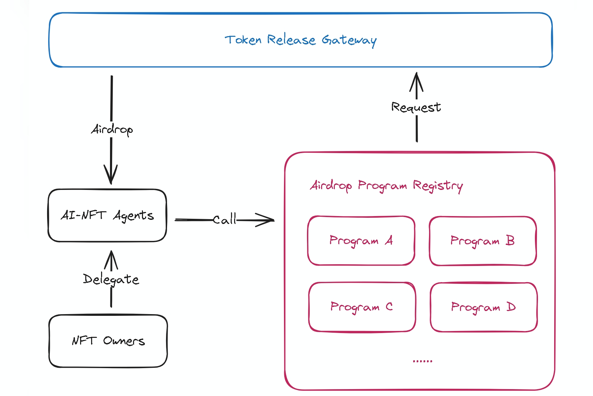

# Airdrop Proxy 🎯
Enables AI-NFTs to claim airdrops and delegate airdrop eligibility. This service is part of the [xNomad](https://docs.xnomad.ai/) ecosystem.

## ✨ Features

- **Airdrop Delegation**: Securely delegate your airdrop eligibility to another wallet
- **Action Hooks**: Customizable hooks for pre and post-airdrop actions
- **Multi-chain Support**: Support for various blockchain networks

## ⛓️ Supported Networks
- Solana
- EVM (Coming soon)

## Airdrop Proxy Workflow
  

### Airdrop Program Registration

Project teams use the provided API to register their airdrop programs.
During registration.

### AI-NFT Agents
#### Eligibility Check:

Agent can check their eligibility for the airdrop using the checkEligibilityUrl provided during registration.
#### Claim Process:

Eligible users can claim their airdrops through the claimUrl.
The system processes the claim request and distributes the airdrop rewards to the user's wallet.

### AI-NFT Owners
#### Delegation (Optional):

If enabled, users can delegate their airdrop eligibility to agent wallet.
This feature is useful for scenarios where users want to transfer their eligibility without transferring ownership of the underlying assets.


## 🛠️ Primary Use Case  
Project teams can register their airdrop programs using the following API. 

### Airdrop Registration API  

**Endpoint**:  
`POST https://airdrop-proxy.xnomad.ai/registry/registry`  

**Headers**:  
`Content-Type: application/json`  

**Request Body**:  
Below is an example of the request payload with parameter explanations:  

```json  
{  
  "protocol": "AirdropProgramRegistry",
  "version": "0.0.1",
  "name": "xNomad Genesis NFT Airdrop",   // Name of the your airdrop program  
  "description": "Give 15% of NFT mint price as Xnomad AI Agent Initial funds", // Description of the your airdrop program  
  "issuer": {                          // Replace with your project's corresponding information  
    "name": "Xnomad.fun",              // Issuer's name  
    "officialWebsite": "https://xnomadai.com", // Issuer's official website  
    "image": "https://xnomad.ai/mint/logo.svg", // Issuer's logo URL  
    "twitter": "https://x.com/xNomadAI", // Issuer's Twitter profile  
    "telegram": "xnomad",              // Issuer's Telegram handle  
    "discord": "https://discord.com/invite/xnomad", // Issuer's Discord link  
    "contract": "optional_contract_address", // (Optional) Contract address for the airdrop  
    "token": "optional_token_address"  // (Optional) Token address for the airdrop  
  },  
  "airdropRules": {                      // Rules for the airdrop  
    "target": "nftAIAgent || nftHolder", // Target audience for the airdrop  
    "claimMethod": "http",               // Method for claiming the airdrop  
    "claimUrl": "https://project.endpoint/claim", // URL for claiming the airdrop  
    "checkEligibilityUrl": "https://project.endpoint/check", // URL to check eligibility  
    "blockchain": "solana",            // Blockchain network for the airdrop  
    "contract": null,                  // (Optional) Contract address for the airdrop  
    "supportDelegate": false,          // Whether delegation is supported  
    "startAt": "2025-02-07T12:00:00Z", // Start time of the airdrop  
    "expiresAt": "2025-02-10T12:00:00Z", // Expiration time of the airdrop  
    "estimateCost": null               // (Optional) Estimated cost of the airdrop  
  }  
}
```

### Notes
After successfully registering your airdrop program, please contact us to enable the claim functionality for your users.
Once enabled, users will be able to claim their airdrops and check eligibility.

## 🔐 URL Signature Requirements

When registering your project on airdrop-proxy, claim URL must implement signature verification. This ensures secure communication between the agent and your service.

### Signature Verification Implementation

Your endpoint should implement this verification logic:

```typescript
import { PublicKey } from '@solana/web3.js';
import * as bs58 from 'bs58';
import * as nacl from 'tweetnacl';

async function verifySignature(
    walletAddress: string,
    message: string,
    signature: string,
): Promise<boolean> {
    try {
        const publicKey = new PublicKey(walletAddress);
        const encodedMessage = new TextEncoder().encode(message);
        const decodedSignature = bs58.decode(signature);

        return nacl.sign.detached.verify(
            encodedMessage,
            decodedSignature,
            publicKey.toBytes(),
        );
    } catch (error) {
        console.error('Signature verification error:', error);
        return false;
    }
}
```
## 📜 License

This project is licensed under the MIT License - see the [LICENSE](LICENSE) file for details.

## 📞 Contact & Support

- **Website**: [xnomad.ai](https://xnomad.ai)
- **Twitter**: [@xNomadAI](https://x.com/xNomadAI)

For technical support:
- Open an issue in this repository
- Join our [Discord community](https://discord.gg/xnomad)
